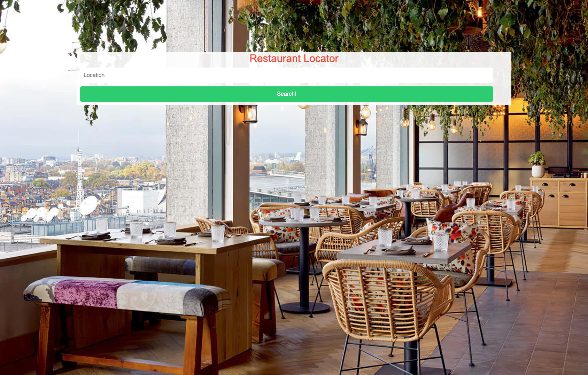

# Cuisine Locator

```
Welcome to Cuisine Locator!  This website enables you to enter the name of any city and see local restaurant options.  You are given a thumbnail image from the restaurant, the type of cuisine the restaurant serves, and it's average rating from 0-5. By clicking the "More Info" button, the user can access the restaurants location, email address, and website. 
```

## User Story

```
AS A Foodie looking for somewhere to eat, 
I WANT to be able to find different cuisine based on my current location,
SO THAT I can satisfy my hunger
```

## Acceptance Criteria

```
GIVEN a webpage with a location input
WHEN I search my location
THEN I am presented with a list of local restaurants
WHEN I view the restaurants
THEN I am presented with the name, cuisine type, rating, and a thumbnail
WHEN I select a specific restaurant
THEN I am presented with the address, email, and phone number
```


Github Repo: https://github.com/chrisnastro/first-group-project

Deployed Site: https://chrisnastro.github.io/first-group-project/

